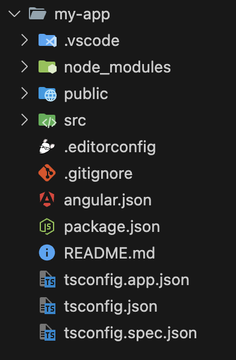

# Anatomy of an Angular Project

Understanding the anatomy of a project using Angular is essential for building and maintaining robust Angular applications. Developers can navigate and manage the codebase efficiently by understanding the components and folder structure within a project using Angular. Let’s delve deeper into the anatomy of a project in Angular.

## my-app

The my-
