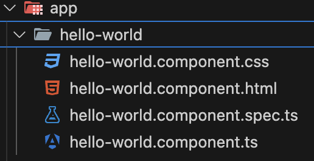

# Generating a Component

Creating a component in Angular is a fundamental task that can be easily accomplished using the Angular CLI. Follow these steps to generate a new component in your Angular project.

## Step 1: Open Terminal

Open your terminal or command prompt. Ensure you are in the root directory of your Angular project.

## Step 2: Run the Generate Command

Use the Angular CLI to generate a new component by running the following command:

```sh
ng generate component component-name
```

or the shorthand:

```sh
ng g c component-name
```

Replace component-name with the desired name of your component. For example, if you want to create a hello-world component, you would run:

```sh
ng g c hello-world
```

### Verify Component Creation



The CLI will generate several files for your new component and update some existing files to include your new component. Check the `src/app` directory to see the newly created component folder.

## Conclusion

You have successfully generated a new component in your Angular project. In the next file, we will explore the files created by this command and their purposes.
