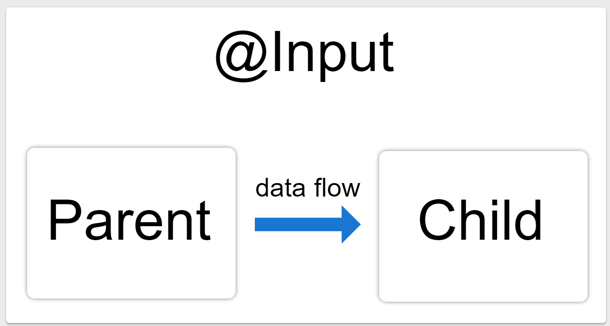

# Input Communication



## Introduction
In Angular, the `@Input` decorator is used to pass data from a parent component to a child component. This is a fundamental concept in Angular for component interaction and data sharing.

## How @Input Works
The `@Input` decorator allows a parent component to bind a property in a child component. This makes it possible to pass data into the child component when the parent component is rendered.

### Example
Let's look at an example where we pass a `name` property from a parent component to a child component.

#### Parent Component

```typescript
import { Component } from '@angular/core';

@Component({
  selector: 'app-parent',
  template: `
    <h1>Parent Component</h1>
    <app-child [name]="parentName"></app-child>
  `,
})
export class ParentComponent {
  parentName: string = 'Angular';
}
```

#### Child Component

```typescript
import { Component, Input } from '@angular/core';

@Component({
  selector: 'app-child',
  template: `
    <h2>Child Component</h2>
    <p>Name: {{ name }}</p>
  `,
})
export class ChildComponent {
  @Input() name: string;
}
```
## Detailed Explanation

### Step 1: Define the Input Property
In the child component, use the `@Input` decorator to define an input property.

```typescript
@Input() name: string;
```

### Step 2:  Bind the Property in the Parent Component
In the parent component template, bind the input property using property binding syntax.

```html
<app-child [name]="parentName"> </app-child>
```


## Conclusion
The `@Input` decorator is a powerful feature in Angular that facilitates communication between components. By understanding and using `@Input`, you can create more modular and maintainable Angular applications.