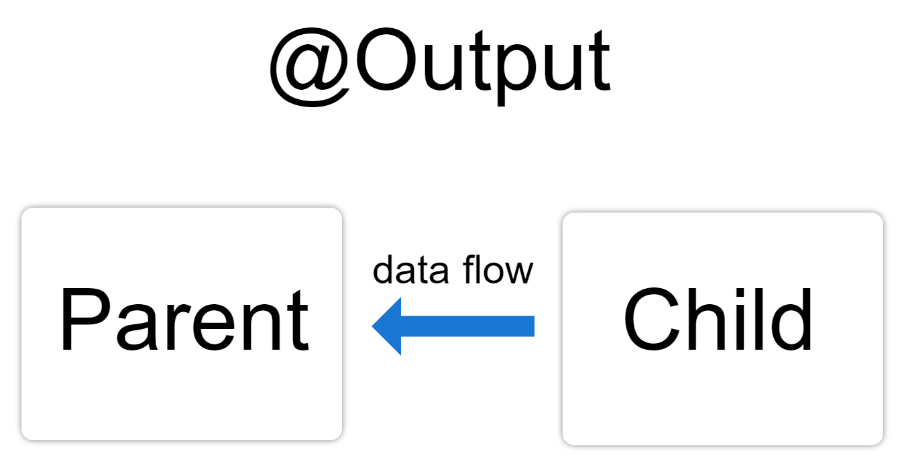

# Output Communication



## Introduction
In Angular, the `@Output` decorator is used to emit events from a child component to a parent component. This allows the parent component to listen to events and take action when they occur.

## How @Output Works
The `@Output` decorator, along with an `EventEmitter`, allows a child component to send data or signals to a parent component when a specific event occurs.

### Example
Let's look at an example where we emit an event from a child component to a parent component.

#### Parent Component

```typescript
import { Component } from '@angular/core';

@Component({
  selector: 'app-parent',
  template: `
    <h1>Parent Component</h1>
    <app-child (notify)="onNotify($event)"></app-child>
    <p>{{ message }}</p>
  `,
})
export class ParentComponent {
  message: string;

  onNotify(message: string): void {
    this.message = message;
  }
}
```
#### Child Component

```typescript
import { Component, Output, EventEmitter } from '@angular/core';

@Component({
  selector: 'app-child',
  template: `
    <h2>Child Component</h2>
    <button (click)="sendNotification()">Notify Parent</button>
  `,
})
export class ChildComponent {
  @Output() notify = new EventEmitter<string>();

  sendNotification(): void {
    this.notify.emit('Message from Child Component');
  }
}

```
In this example, the `ChildComponent` emits an event when the button is clicked, and the `ParentComponent` listens to this event and updates its `message` property accordingly.

## Detailed Explanation

### Step 1: Define the Output Property
In the child component, use the `@Output` decorator to define an output property, which is an instance of `EventEmitter`.

```typescript
@Output() notify = new EventEmitter<string>();
```

### Step 2:  Emit an Event
Use the `emit` method of `EventEmitter` to send an event with a payload

```typescript 
sendNotification(): void {
  this.notify.emit('Message from Child Component');
}
```
### Step 3:  Bind the Event in the Parent Component
In the parent component template, bind to the child component's event using event binding syntax.

```typescript 
<app-child (notify)="onNotify($event)"></app-child>
```

### Step 4: Handle the Event in the Parent Component
Implement a method in the parent component to handle the event.

```typescript
onNotify(message: string): void {
  this.message = message;
}
```
## Conclusion
The `@Output` decorator is a powerful feature in Angular that facilitates communication from child components to parent components. By understanding and using `@Output`, you can create more interactive and dynamic Angular applications.


