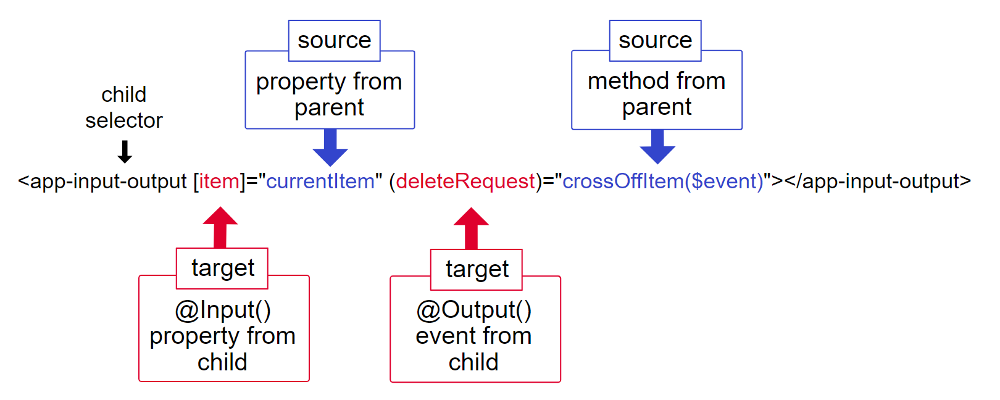

# Input & Output Communication



## Introduction
In Angular, `@Input` and `@Output` decorators are used for component interaction. `@Input` allows a parent component to pass data to a child component, while `@Output` allows a child component to emit events to a parent component.

## How @Input and @Output Work Together
The combination of `@Input` and `@Output` enables two-way communication between components, allowing for dynamic and interactive applications.

### Example
Let's look at an example where we pass a `name` property from a parent component to a child component and the child component emits an event back to the parent component.

#### Parent Component

```typescript
import { Component } from '@angular/core';

@Component({
  selector: 'app-parent',
  template: `
    <h1>Parent Component</h1>
    <app-child [name]="parentName" (nameChange)="onNameChange($event)"></app-child>
    <p>Received Name: {{ receivedName }}</p>
  `,
})
export class ParentComponent {
  parentName: string = 'Angular';
  receivedName: string;

  onNameChange(newName: string): void {
    this.receivedName = newName;
  }
}
```
#### Children Component

```typescript
import { Component, Input, Output, EventEmitter } from '@angular/core';

@Component({
  selector: 'app-child',
  template: `
    <h2>Child Component</h2>
    <p>Name: {{ name }}</p>
    <button (click)="changeName()">Change Name</button>
  `,
})
export class ChildComponent {
  @Input() name: string;
  @Output() nameChange = new EventEmitter<string>();

  changeName(): void {
    const newName = 'Changed Name';
    this.nameChange.emit(newName);
  }
}
```
In this example, the `ParentComponent` passes the `parentName` variable to the `ChildComponent` through the property, and the `ChildComponent` emits a `nameChange` event back to the `ParentComponent`.

## Detailed Explanation

### Step 1: Define the Input Property
In the child component, use the `@Input` decorator to define an input property.

```typescript
@Input() name: string;
```

### Step 2: Define the Output Property
Use the `@output` decorator to define an output property, which is an instance of  `EventEmitter`.

```typescript 
@Output() nameChange = new EventEmitter<string>();
```
### Step 3:  Emit an Event
Use the `emit` method of `EventEmitter` to send an event with a payload.

```typescript 
changeName(): void {
    const newName = 'Changed Name';
    this.nameChange.emit(newName);
}
```
### Step 4: Bind the Properties and Events in the Parent Component
In the parent component template, bind the input property and the output event.

```typescript
<app-child [name]="parentName" (nameChange)="onNameChange($event)"></app-child>
```
### Step 5: Handle the Event in the Parent Component

Implement a method in the component to handle the event.

```typescript
onNameChange(newName: string): void {
    this.receivedName = newName;
}
```


## Conclusion
The `@Input` and `@Output` decorators are powerful features in Angular that facilitate communication between components. By understanding and using these decorators, you can create more interactive and dynamic Angular applications.


